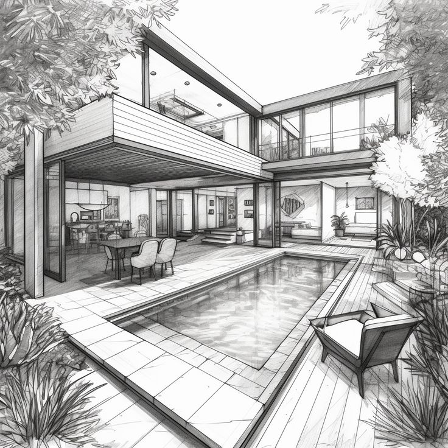
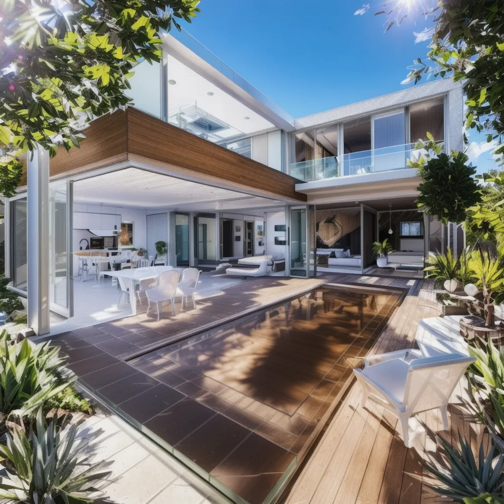
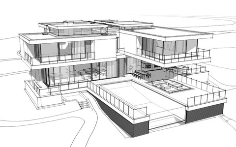
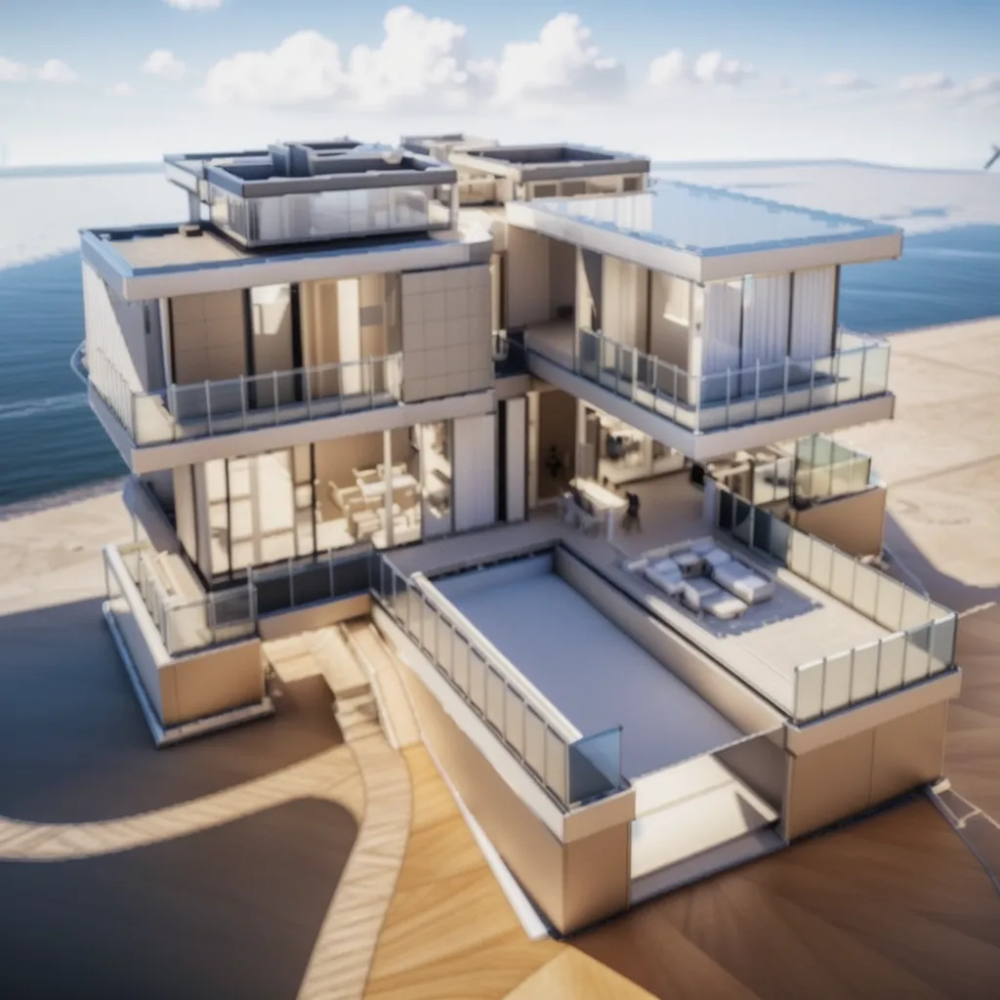
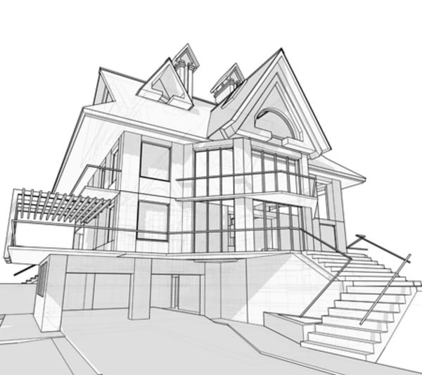
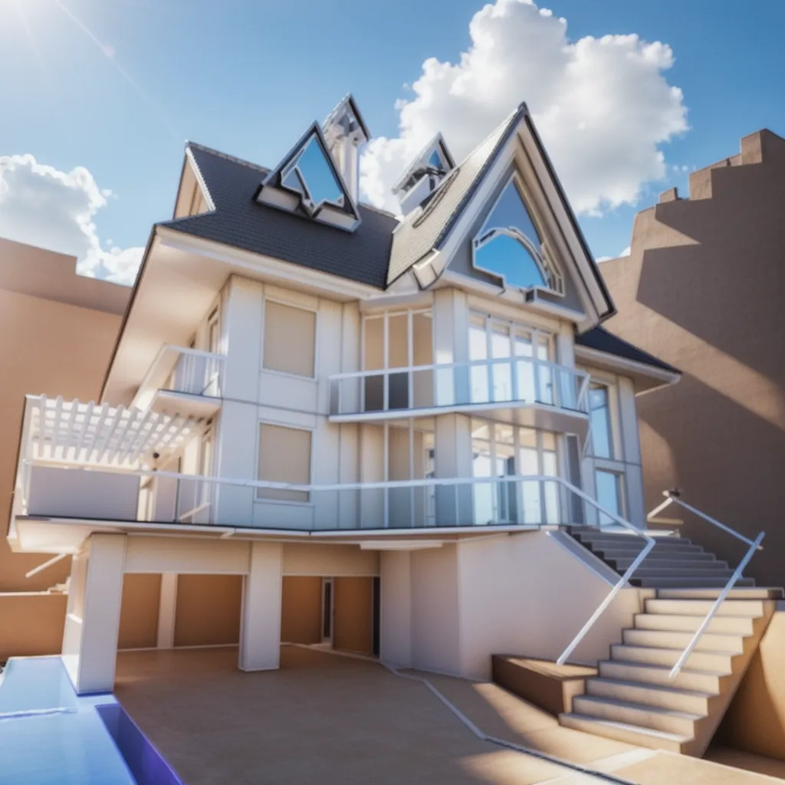
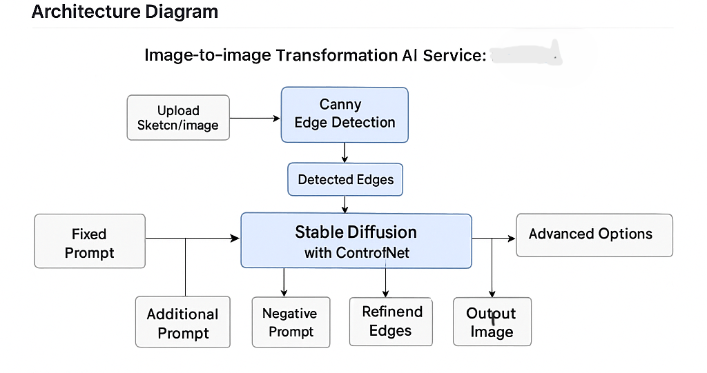

# 🏗️ Sketch-to-Building AI Generator

Turn your architectural sketches into **photo-realistic building renders** using **ControlNet + Stable Diffusion**, with advanced **prompt engineering** — built for the **WHERENESS AI Take-Home Challenge**.

---

## 🚀 Live Demo

🔗 [Click here to try the hosted app](https://your-gradio-link-here.com)  
⚠️ You can upload your own sketch and press **Generate** — no setup required.

---

## 🧠 Project Overview

This project transforms **hand-drawn architectural sketches** into **realistic building images** using:

- `ControlNet (Canny)` to enforce structural precision
- `Realistic Vision V6` as the base model for photorealism
- Carefully crafted fixed prompt for consistency
- Web UI powered by Gradio

---

## 🧠 Approach

This solution uses **advanced prompt engineering** (Option 2 in the challenge guidelines). No model fine-tuning was required.

### Why Prompt Engineering?

Fine-tuning within the available timeframe and dataset constraints would not yield strong generalization. Instead, powerful prompting, careful conditioning with Canny maps, and a photorealistic base model were sufficient to steer outputs to meet fidelity requirements.

---

## 🎨 Fixed Prompt Strategy

```
clear sky, sunny day, architecture, FullHD, residential, photo realistic, hyperrealistic, super detailed, intricate, shadows, high dynamic range, reflecting window, raytracing
```

This prompt ensures:

- ✅ Outdoor realistic lighting
- ✅ Photorealistic architectural detail
- ✅ Rendering quality with ray tracing, HDR, etc.
- ✅ Material realism (e.g., reflective windows, shadows)

---

## 🚫 Negative Prompt Strategy

```
blurry, cartoon, duplicate windows, poorly drawn, distorted
```

This prevents:

- ❌ Artistic or cartoon-style renders
- ❌ Distorted windows or duplications
- ❌ Blurry, low-quality generations

---

## ⚙️ Advanced Options (Defaults & Rationale)

| Option               | Default | Why?                                                   |
| -------------------- | ------- | ------------------------------------------------------ |
| Image Resolution     | 1024    | Maximum safe resolution for model stability and detail |
| Num Images           | 1       | Prevent overload; high quality per sketch              |
| Canny Low Threshold  | 100     | Ideal to catch prominent sketch edges without noise    |
| Canny High Threshold | 200     | Preserves architectural lines, avoids excess detailing |
| Steps                | 50      | Balanced between speed and convergence quality         |
| Guidance Scale       | 9.0     | Strong prompt adherence without overfitting            |
| Seed                 | 0       | Can be randomized per generation                       |
| Randomize Seed       | ✅      | Encourages diverse outputs                             |

---

## 📉 Why Canny and Not Depth?

While `depth` maps were initially considered, they performed **poorly** due to:

- Inaccurate estimation on abstract sketches.
- Misalignment between sketch contours and predicted depth.
- Over-simplification of flat 2D lines into depth volumes.

**Canny**, on the other hand:

- Accurately preserves edge outlines of windows, floors, and geometry.
- Offers precise conditioning to the model while keeping generation stable.
- Ideal for abstract sketches, which only define contours and structure.

---

## 🖼️ Example Inputs & Outputs

| Input Sketch                                             | Photorealistic Output                                           |
| -------------------------------------------------------- | --------------------------------------------------------------- |
|  |  |
|                            |                            |
|                            |                            |
|                             |                             |

---

## 🔧 Core Strategy: Prompt Engineering + Pretrained Models

Rather than fine-tuning, this solution **strategically leverages pre-trained models** and **prompt design** to generate outputs that:

- Match the **number of windows**
- Respect the **structure and layout**
- Include realistic **construction materials**

---

## 🧱 Model Architecture

| Component  | Description                                                    |
| ---------- | -------------------------------------------------------------- |
| ControlNet | `lllyasviel/control_v11p_sd15_canny` – for sketch conditioning |
| Base Model | `SG161222/Realistic_Vision_V6.0_B1_noVAE` – photo-realism      |
| Scheduler  | `UniPCMultistepScheduler`                                      |
| Frameworks | PyTorch, Diffusers, OpenCV, PIL, Gradio                        |

---

## 📐 Input Processing Flow

1. Sketch is resized and converted to grayscale.
2. Canny edge detection generates an edge map.
3. The map is passed to ControlNet to guide image generation.
4. The model combines this map with fixed and additional prompts to output photo-realistic architectural images.

---

## 💻 Web Interface (Gradio)

- Built with **Gradio Blocks** for modular and interactive design.
- Upload your hand-drawn sketch.
- Click `Generate` to view the AI-generated photorealistic building image.
- Customize optional advanced settings: resolution, Canny thresholds, steps, seed, etc.

### Screenshot:


---

## 🛠️ How to Run Locally

1. Clone repo:

```bash
git clone https://github.com/proplunger/WHERENESS-challenge.git
cd sketch-to-real
```

2. Run the notebook:

```bash
python ACTUAL_assignemnt.ipynb
```

---

## 🏗️ Architecture Diagram



---

## 🧾 Methodology Summary

- **Model**: `SG161222/Realistic_Vision_V6.0_B1_noVAE`
- **Conditioning**: `lllyasviel/control_v11p_sd15_canny`
- **Inference Framework**: Diffusers + Gradio
- **Hosting**: Gradio/Colab link (shareable)
- **Input**: PIL Image (sketch), auto-converted to Canny edge
- **Prompt Engineering**: Fixed prompt + adjustable seed/guidance

---

## ✅ Assessment Criteria

| Criteria               | How it was fulfilled                                               |
| ---------------------- | ------------------------------------------------------------------ |
| **Prompting Strategy** | Strong fixed + additional/negative prompts                         |
| **Output Fidelity**    | Canny ensures shape & window count, prompt ensures photorealism    |
| **Engineering**        | Fully working Gradio UI, hosted publicly                           |
| **Strategic Thinking** | Deep rationale on Canny vs Depth, prompt design, UI simplification |

---

## 📬 Contact

Made with ❤️ by **Aryan Rawat**  
📧 [AryanRawat895@gmail.com](mailto:AryanRawat895@gmail.com)  
🔗 [LinkedIn](https://www.linkedin.com/in/aryan-rawat-b5a36623b) | [GitHub](https://github.com/proplunger)

---

## License / Usage

This project was created as part of a take-home challenge for the [WHERENESS Prompt Engineer Challenge].  
It is shared publicly **for demonstration purposes only**. Please do not reuse, distribute, or modify this code without explicit permission.
